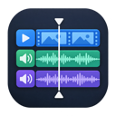
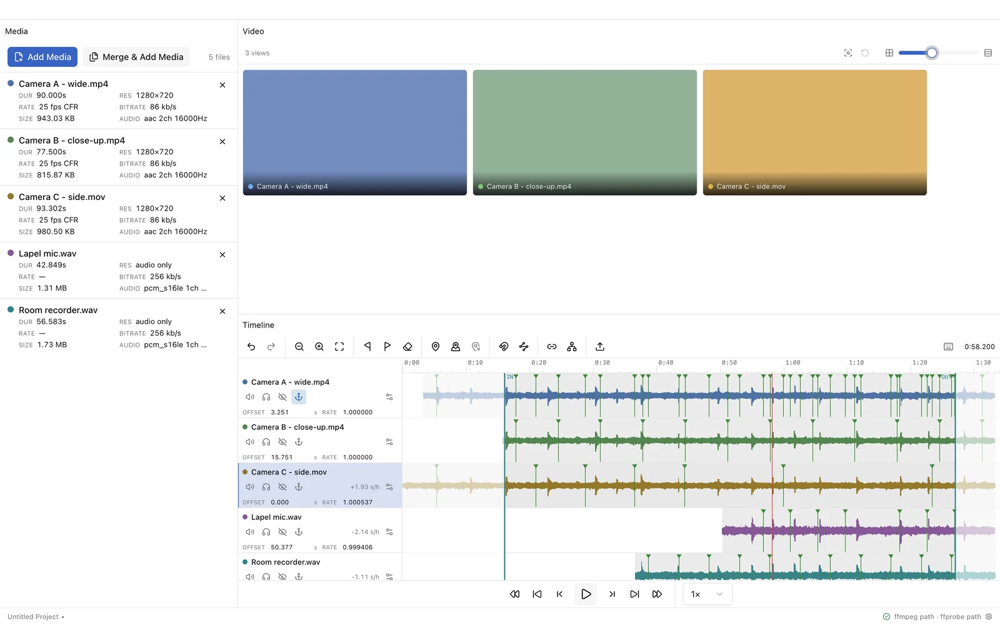

    

<h1 align="center">Video Alignment Tool</h1>

    Line up every camera and microphone from one event. 
    Free for Windows, macOS and Linux. No account, no upload.

    <a href="https://github.com/LiminalSpaces/video-align-dist/releases/latest"><b>Download the latest release</b></a>
    ·
    <a href="https://alignment_tool.alexstein.ca">Website</a>
    ·
    <a href="https://alignment_tool.alexstein.ca/guide/">Guide</a>

## What it does

You filmed one event on two cameras and recorded it on a couple of audio recorders. Every device started at a different moment, so the files don't line up. Video Alignment Tool compares the sound in each recording, slides every one into place on a shared timeline, and exports them all trimmed to the same start and end. A moment then has the same timestamp in every file.

- **Automatic alignment from sound.** No clapperboard needed. The app matches ordinary sound that every microphone picked up and reports how confident it is in each match.
- **Clock drift correction.** A recorder that gains two seconds an hour gets measured and corrected, so the end of a long session lines up as well as the start.
- **Sync by marking a moment.** When the sound is too different to compare, mark the same clap or door slam in each recording and the app lines them up from your marks.
- **Manual alignment.** Drag any recording on the timeline and snap it to another's markers.
- **Synced playback.** Every camera plays side by side from one clock.
- **Synced exports.** Every file comes out the same length. Keep the original quality, or set format, size, frame rate and quality per recording.
- **Split camera files.** Merge the chunks a GoPro or similar camera writes into one file, usually without re-encoding.

It opens MP4, MOV, MKV, AVI, MTS/M2TS, MXF, WebM, WAV, AIFF, MP3, FLAC, M4A and more.

In testing against simulated recordings with known offsets, it recovers start times to within 1 ms and clock drift to within 25 ms per hour.

## Download

Get the files from the [latest release](https://github.com/LiminalSpaces/video-align-dist/releases/latest), or use the [download page](https://alignment_tool.alexstein.ca/download/), which picks the right one for your computer.

| Computer                             | File   | Notes                                                                   |
| ------------------------------------ | ------ | ----------------------------------------------------------------------- |
| Windows 10 or 11, 64-bit             | `.exe` | Installs for your user account. No administrator rights needed.         |
|                                      | `.msi` | Installs for every user. For IT deployment with Group Policy or Intune. |
| macOS, Apple Silicon and Intel       | `.dmg` | Open it and drag the app into Applications.                             |
|                                      | `.pkg` | Installer for IT deployment with Jamf, Kandji or another MDM tool.      |
| Linux, x86-64 (Ubuntu, Debian, Mint) | `.deb` | `sudo apt install ./<file>.deb`                                         |
| Linux, x86-64 (other)                | `.zip` | Unzip anywhere and run `video-alignment-tool`.                          |

The `.nupkg` and `RELEASES` files in each release are for the Windows updater. You don't need to download them.

### First launch

The app uses [ffmpeg](https://ffmpeg.org) to read and write audio and video. The first time you open it, it offers to download ffmpeg into your user settings folder. That takes one click and about 60 MB, with no administrator rights. If you already have ffmpeg installed, point the app at your copy instead.

## How to use it

The [guide](https://alignment_tool.alexstein.ca/guide/) walks through adding recordings, aligning them, checking the result and exporting, with screenshots of each step. It's written for people who have never used video editing software.

## About this repository

This repository holds the release builds and the issue tracker. The source code is kept in a separate, private repository.

`ffmpeg-manifest.json` lists where the app downloads ffmpeg from. The app reads it from this repository each time it installs ffmpeg, so a moved download link gets fixed here without a new release.

## Reporting a problem

[Open an issue](https://github.com/LiminalSpaces/video-align-dist/issues/new/choose). Include your operating system, which version you installed, and the steps that caused the problem. Please don't attach recordings you aren't allowed to share.

## Privacy and license

The app processes your recordings on your own computer and never uploads them. It has no accounts, analytics or tracking. It only goes online to check for updates and, if you ask it to, to download ffmpeg. The full text is in [PRIVACY_AND_TERMS.md](PRIVACY_AND_TERMS.md).

Video Alignment Tool is free under the [MIT License](LICENSE). ffmpeg is a separate project under its own [LGPL and GPL licenses](https://ffmpeg.org/legal.html).
